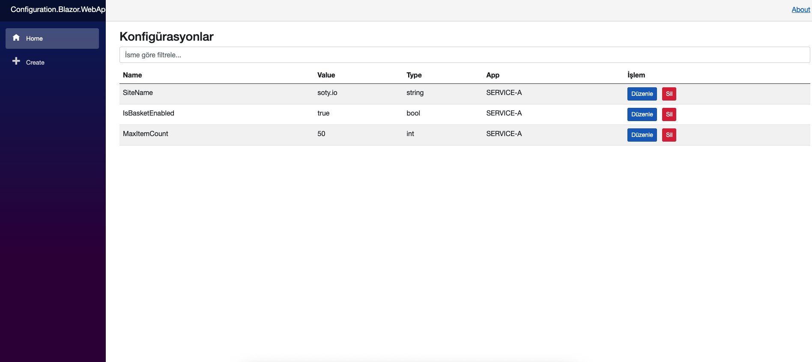
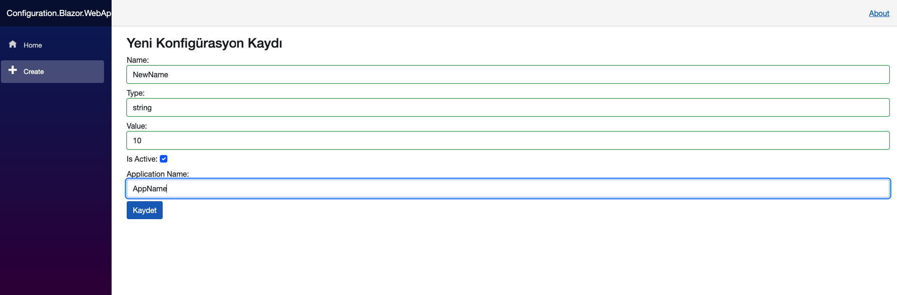
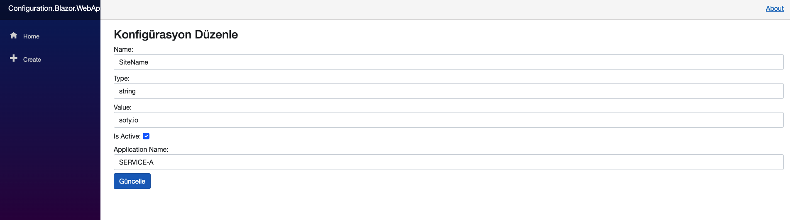

# Configuration Management System (Blazor + MongoDB)
---
## 🛠 Kullanılan Teknolojiler

- **.NET 8**
- **Blazor Server**
- **MongoDB 6.0**
- **Docker**
- **xUnit (Unit Test için)**
- **Dependency Injection**
- **LINQ, TPL, async/await**
- **Design Patterns (Repository, Singleton, Timer)**
- **VS Code & Docker Desktop**
- **Git / GitHub versiyon kontrol**


## ⚙️ Kurulum
Projeyi çalıştırmak için aşağıdaki adımları uygulayabilirsiniz:

### 1. Kaynak Kodları Klonlayın
```bash
git clone https://github.com/ulukayasaban/ConfigurationProject
cd ConfigurationProject
```
### 2. Docker Üzerinden Tüm Sistemi Başlatın
```bash
docker compose up --build
```
Bu işlem hem MongoDB'yi hem de Blazor uygulamasını ayağa kaldırır.

### 3. Tarayıcıda Açmak
Blazor Web uygulaması:
```bash
http://localhost:5050
```

### MongoDB Docker container’ı:
```makefile
localhost:27017
```

## 🧩 Proje Yapısı

```css
ConfigurationProject/
├── ConfigurationLibrary/           → Konfigürasyon logic katmanı (MongoRepository, Models, ConfigurationReader)
├── Configuration.Blazor.WebApp/   → Blazor Web Arayüzü
├── ConfigurationLibrary.Tests/    → Unit test dosyaları
├── ConfigurationConsoleApp/       → Console App
├── docker/                         → MongoDB için init-mongo.js (başlangıç verisi)
├── docker-compose.yml             → Servisleri ayağa kaldıran yapı
├── assets/                         → Ekran görüntüleri ve medya dosyaları
└── README.md                       → Bu dokümantasyon
```
## 🔄 Uygulama Kullanımı
### Web Arayüzü (Blazor)
-   Yeni kayıt ekle: `/create`

-   Kayıtları listele: `/`

-   Kayıt düzenleme: `/edit/{id}`

-   İsme göre filtreleme (client-side) özelliği bulunmaktadır.

### ConfigurationReader Kullanımı
```csharp
var reader = new ConfigurationReader("SERVICE-A", "mongodb://localhost:27017", 10000);
var siteName = reader.GetValue<string>("SiteName");
```

`GetValue<T>` metodu, kayıtların tipini otomatik algılayarak uygun dönüş sağlar.

### Timer ve Cache Mantığı
-   `RefreshDataAsync` ile periyodik olarak MongoDB’den veriler çekilir.

-   Storage’a ulaşılamazsa son başarılı veri kümesi kullanılmaya devam edilir.

## ✅ Fonksiyonel Özellikler
-   Konfigürasyonların `IsActive` kontrolü yapılır.

-   `ApplicationName` ile kayıt erişimi sınırlandırılmıştır.

-   Tip dönüşümler güvenli şekilde `GetValue<T>` metodu ile sağlanır.

-   Storage verileri her `X` ms'de bir yenilenir.

-   Blazor UI üzerinden CRUD işlemleri yapılabilir.

## 🧪 Unit Testler
Testler ConfigurationLibrary.Tests projesi altında xUnit ile yazılmıştır.
```bash
dotnet test ConfigurationLibrary.Tests/ConfigurationLibrary.Tests.csproj

```
-   MongoRepository metotları test edildi

-   ConfigurationReader testleri Mock kullanarak yazıldı

-   RefreshDataAsync işlevi kontrol edildi

## 🐳 Docker Bilgileri
### docker-compose.yml
```yaml
services:
  mongodb:
    image: mongo:6.0
    container_name: configurationproject-mongo
    ports:
      - "27017:27017"
    volumes:
      - mongo_data:/data/db
      - ./docker/init-mongo.js:/docker-entrypoint-initdb.d/init-mongo.js:ro
    environment:
      MONGO_INITDB_DATABASE: ConfigurationDb

  blazorweb:
    build:
      context: .
      dockerfile: Configuration.Blazor.WebApp/Dockerfile
    container_name: configurationproject-blazor
    ports:
      - "5050:8080"
    depends_on:
      - mongodb

volumes:
  mongo_data

```


### Blazor Dockerfile
```dockerfile
FROM mcr.microsoft.com/dotnet/sdk:8.0 AS build
WORKDIR /src
COPY ConfigurationLibrary/*.csproj ./ConfigurationLibrary/
COPY Configuration.Blazor.WebApp/*.csproj ./Configuration.Blazor.WebApp/
RUN mkdir ConfigurationLibrary.Tests
RUN mkdir ConfigurationConsoleApp
COPY . .
WORKDIR /src/Configuration.Blazor.WebApp
RUN dotnet restore
RUN dotnet publish -c Release -o /app/publish

FROM mcr.microsoft.com/dotnet/aspnet:8.0
WORKDIR /app
COPY --from=build /app/publish .
ENV ASPNETCORE_ENVIRONMENT=Production
ENTRYPOINT ["dotnet", "Configuration.Blazor.WebApp.dll"]

```

## 🧩 Başlangıç Verisi
Aşağıdaki kayıtlar container başlatıldığında MongoDB’ye otomatik yüklenir:
```js
db = db.getSiblingDB('ConfigurationDb');

db.Configurations.insertMany([
  {
    Name: "SiteName",
    Type: "string",
    Value: "soty.io",
    IsActive: true,
    ApplicationName: "SERVICE-A"
  },
  {
    Name: "IsBasketEnabled",
    Type: "bool",
    Value: "true",
    IsActive: true,
    ApplicationName: "SERVICE-B"
  },
  {
    Name: "MaxItemCount",
    Type: "int",
    Value: "50",
    IsActive: false,
    ApplicationName: "SERVICE-A"
  }
]);
```


## 📌 Ekstra Özellikler
-   VSCode desteği

-   Git ile versiyon takibi (GitHub'a push edildi)

-   Geliştirme ortamında launchSettings.json yapılandırıldı

-   Üretim ortamında Docker üzerinden çalışacak şekilde yapılandırıldı

### 📸 Ekran Görüntüleri

#### Ana Sayfa


### Yeni Configuration Sayfası


### Configuration Düzenleme Sayfası

